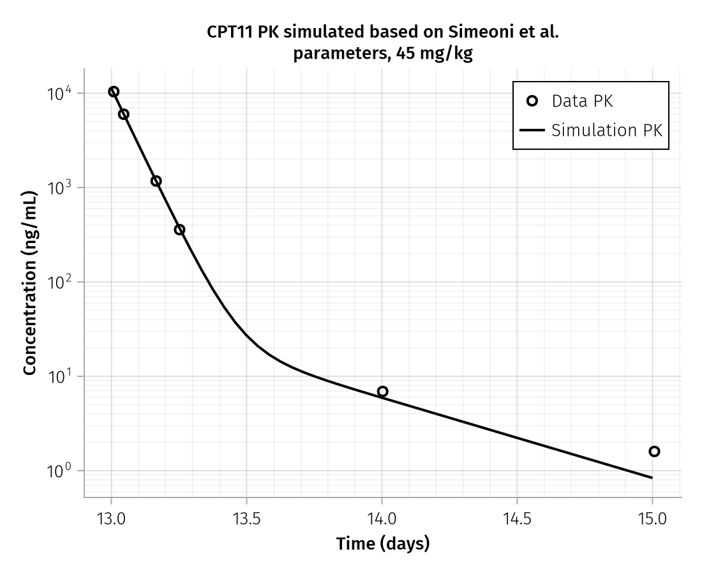
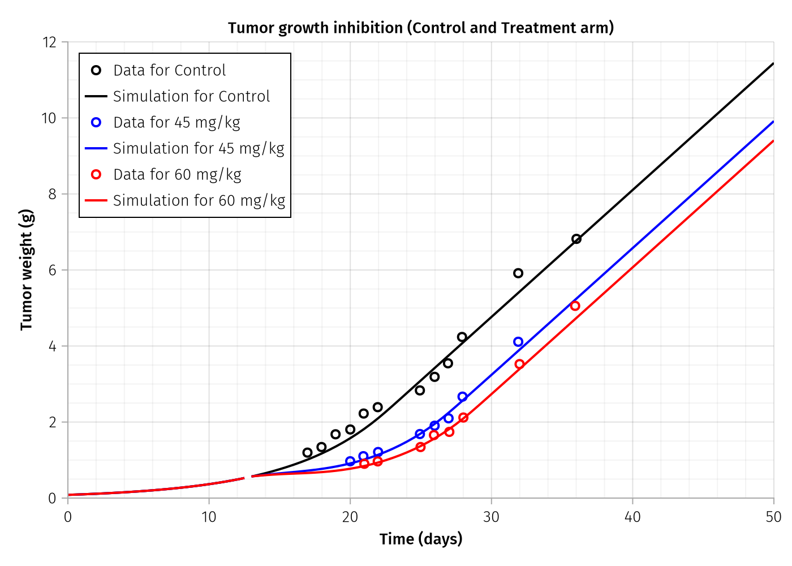

## Introduction

The Simeoni tumor growth inhibition (TGI) model is a mechanistic pharmacokinetic-pharmacodynamic (PK-PD) framework used extensively in cancer drug development. Originally developed to describe the growth kinetics of xenograft tumors in mice and their response to anticancer agents, this model has become a standard tool for preclinical-to-clinical translation.

**Reference**: Simeoni M, et al. (2004) "Predictive Pharmacokinetic-Pharmacodynamic Modeling of Tumor Growth Kinetics in Xenograft Models after Administration of Anticancer Agents." *Cancer Research* 64:1094-1101.

### Clinical Context

Xenograft tumor models are widely used in drug development to:

- Evaluate anticancer drug efficacy before clinical trials
- Optimize dosing schedules for maximum tumor suppression
- Understand the relationship between drug exposure and tumor response
- Predict human tumor response based on preclinical data

The Simeoni model provides a mathematical framework to quantify these relationships and support translational predictions.

---

## Biological Motivation

### Unperturbed Tumor Growth

Tumor growth in the absence of treatment follows a characteristic pattern:

1. **Early stage (exponential growth)**: When the tumor is small, cells have unlimited access to nutrients and oxygen. The tumor mass doubles at a constant rate, leading to exponential growth.

2. **Late stage (linear growth)**: As the tumor grows larger, the interior becomes nutrient-limited. Only the outer rim of cells actively proliferates, resulting in linear (rather than exponential) growth.

3. **Smooth transition**: The transition between these phases is gradual, not abrupt. The Simeoni model captures this with a smooth mathematical transition function.

### Drug-Induced Cell Damage

When an anticancer drug is administered:

1. The drug damages proliferating tumor cells
2. Damaged cells do not die immediately but progress through a series of transit compartments
3. This delay between damage and cell death reflects biological reality (apoptosis is not instantaneous)
4. The transit compartment approach captures the distribution of cell death times

---

## Mathematical Formulation

### Unperturbed Growth Equation

The Simeoni model describes tumor growth using:

$$\frac{dw}{dt} = \frac{\lambda_0 \cdot w}{\left[1 + \left(\frac{\lambda_0}{\lambda_1} \cdot w\right)^\psi\right]^{1/\psi}}$$

where:

| Symbol | Description | Units |
|--------|-------------|-------|
| $w$ | Tumor weight | g |
| $\lambda_0$ | Exponential growth rate | day$^{-1}$ |
| $\lambda_1$ | Linear growth rate | g/day |
| $\psi$ | Transition sharpness | dimensionless |

**Limiting behavior**:

- When $w$ is small: $\frac{dw}{dt} \approx \lambda_0 \cdot w$ (exponential growth)
- When $w$ is large: $\frac{dw}{dt} \approx \lambda_1$ (linear growth)

The parameter $\psi$ (typically fixed at 20) controls how sharply the transition occurs. Higher values create a more abrupt switch between growth phases.

### Drug-Perturbed Dynamics

When drug is present, the model uses four compartments to track tumor cells:

- **x₁**: Proliferating (drug-sensitive) cells
- **x₂, x₃, x₄**: Damaged cells progressing through transit compartments toward death

The ODE system becomes:

$$\frac{dx_1}{dt} = \text{growth} - k_2 \cdot c(t) \cdot x_1$$

$$\frac{dx_2}{dt} = k_2 \cdot c(t) \cdot x_1 - k_1 \cdot x_2$$

$$\frac{dx_3}{dt} = k_1 \cdot (x_2 - x_3)$$

$$\frac{dx_4}{dt} = k_1 \cdot (x_3 - x_4)$$

where:

| Symbol | Description | Units |
|--------|-------------|-------|
| $k_2$ | Drug potency | mL/(ng·day) |
| $k_1$ | Transit rate constant | day$^{-1}$ |
| $c(t)$ | Plasma drug concentration | ng/mL |

The total tumor weight at any time is: $w = x_1 + x_2 + x_3 + x_4$

The growth term uses the same Simeoni equation but applied to proliferating cells:

$$\text{growth} = \frac{\lambda_0 \cdot x_1}{\left[1 + \left(\frac{\lambda_0}{\lambda_1} \cdot w\right)^\psi\right]^{1/\psi}}$$

---

## Pharmacokinetic Model

The drug concentration is described by a 2-compartment PK model with micro-rate constant parameterization:

$$\frac{d(\text{Central})}{dt} = -k_{el} \cdot \text{Central} - k_{12} \cdot \text{Central} + k_{21} \cdot \text{Peripheral}$$

$$\frac{d(\text{Peripheral})}{dt} = k_{12} \cdot \text{Central} - k_{21} \cdot \text{Peripheral}$$

The plasma concentration is calculated as:

$$c_p = \frac{\text{Central}}{V_c} \times 1000 \quad \text{(ng/mL)}$$

### PK Parameters

| Parameter | Description | Units |
|-----------|-------------|-------|
| $k_{el}$ | Elimination rate constant | day$^{-1}$ |
| $k_{12}$ | Central → Peripheral rate | day$^{-1}$ |
| $k_{21}$ | Peripheral → Central rate | day$^{-1}$ |
| $V_c$ | Central volume | L |

---

## Model Schematic

The complete PK-PD model structure:

```{mermaid}
%%| echo: false

%%| fig-width: 10
flowchart TB
    subgraph PK["<b>PHARMACOKINETICS</b>"]
        direction LR
        Dose([" Dose "]) --> Central["Central<br/>(Amount)"]
        Central -- "k<sub>12</sub>" --> Peripheral["Peripheral<br/>(Amount)"]
        Peripheral -- "k<sub>21</sub>" --> Central
        Central -- "k<sub>el</sub>" --> Elim((" "))
    end

    Central -.-> |"c<sub>p</sub> = Central/V<sub>c</sub> × 1000"| x1

    subgraph PD["<b>PHARMACODYNAMICS</b>"]
        direction LR
        x1["x₁<br/>(Proliferating)"] -- "k₂·c<sub>p</sub>" --> x2["x₂<br/>(Damaged)"]
        x2 -- "k₁" --> x3["x₃<br/>(Damaged)"]
        x3 -- "k₁" --> x4["x₄<br/>(Damaged)"]
        x4 -- "k₁" --> Death((" "))
    end

    Tumor["Tumor = x₁ + x₂ + x₃ + x₄"] -.-> |"growth"| x1
    x1 & x2 & x3 & x4 -.-> Tumor

    style PK fill:#e6f3ff,stroke:#0066cc
    style PD fill:#fff0e6,stroke:#cc6600
    style Dose fill:#90EE90,stroke:#228B22
    style Elim fill:#ffcccc,stroke:#cc0000
    style Death fill:#ffcccc,stroke:#cc0000
    style Tumor fill:#ffffcc,stroke:#999900
```

---

## Simulation Results

### PK Profile (45 mg/kg)

The following figure shows the simulated drug concentration profile compared to observed data following a single 45 mg/kg dose of CPT-11 (irinotecan) administered on Day 13.

{width=80%}

**Key observations**:

- Peak concentration (Cmax) occurs immediately after dosing
- Rapid initial decline reflects distribution phase
- Terminal elimination phase shows the drug half-life
- The 2-compartment model captures the biphasic decline

### Tumor Growth Inhibition (All Doses)

The tumor response to different dose levels demonstrates dose-dependent efficacy.

{width=90%}

**Key observations**:

- **Control**: Tumor grows following the characteristic exponential → linear pattern
- **45 mg/kg**: Partial tumor suppression; growth is slowed but not arrested
- **60 mg/kg**: Greater tumor suppression; tumor growth is substantially inhibited
- Both treated groups show tumor recovery after drug washout (single dose)

---

## Pumas Implementation Highlights

The Simeoni model is implemented in Pumas using several key blocks.

### Parameter Definition (`@param`)

```{julia}
#| output: false
#| eval: false
#| code-fold: true

@param begin
    # PK Parameters (micro-rate constants)
    tvk_el ∈ RealDomain(lower=0.0)     # Elimination rate constant (day⁻¹)
    tvk12  ∈ RealDomain(lower=0.0)     # Central→Peripheral rate (day⁻¹)
    tvk21  ∈ RealDomain(lower=0.0)     # Peripheral→Central rate (day⁻¹)
    tvVc   ∈ RealDomain(lower=0.0)     # Central volume (L)

    # PD Parameters (Simeoni TGI)
    tvlambda0 ∈ RealDomain(lower=0.0)  # Exponential growth rate (day⁻¹)
    tvlambda1 ∈ RealDomain(lower=0.0)  # Linear growth rate (g/day)
    tvk1      ∈ RealDomain(lower=0.0)  # Transit rate constant (day⁻¹)
    tvk2      ∈ RealDomain(lower=0.0)  # Drug potency (mL/ng/day)
    tvw0      ∈ RealDomain(lower=0.0)  # Initial tumor weight (g)
    psi       ∈ RealDomain(lower=1.0)  # Growth switch (FIXED)
end
```

### Intermediate Variables (`@vars`)

The Simeoni growth term is computed in the `@vars` block:

```{julia}
#| eval: false
#| code-fold: true

@vars begin
    # Drug concentration (ng/mL)
    cp = (Central / max(Vc, 1e-10)) * 1000

    # Total tumor weight (sum of all compartments)
    tumor = x1 + x2 + x3 + x4

    # Simeoni growth term with exponential→linear transition
    growth = lambda0 * x1 / (1.0 + (lambda0 / lambda1 * tumor)^psi)^(1.0 / psi)
end
```

### Dynamics (`@dynamics`)

```{julia}
#| eval: false
#| code-fold: true

@dynamics begin
    # PK: 2-Compartment Model
    Central'    = -k_el * Central - k12 * Central + k21 * Peripheral
    Peripheral' = k12 * Central - k21 * Peripheral

    # PD: Simeoni TGI Transit Compartment Model
    x1' = growth - k2 * cp * x1
    x2' = k2 * cp * x1 - k1 * x2
    x3' = k1 * (x2 - x3)
    x4' = k1 * (x3 - x4)
end
```

---

## Summary: Model Parameters

| Parameter | Description | Units | Typical Value |
|-----------|-------------|-------|---------------|
| $\lambda_0$ | Exponential growth rate | day$^{-1}$ | 0.12 - 0.15 |
| $\lambda_1$ | Linear growth rate | g/day | 0.33 - 0.35 |
| $\psi$ | Transition sharpness | — | 20 (fixed) |
| $k_1$ | Transit rate constant | day$^{-1}$ | 0.47 - 0.82 |
| $k_2$ | Drug potency | mL/(ng·day) | 7 - 8 × 10$^{-4}$ |
| $w_0$ | Initial tumor weight | g | 0.085 |
| $k_{el}$ | Elimination rate | day$^{-1}$ | ~13.5 |
| $k_{12}$ | Distribution rate | day$^{-1}$ | ~0.27 |
| $k_{21}$ | Redistribution rate | day$^{-1}$ | ~1.5 - 2.0 |
| $V_c$ | Central volume | L | ~0.08 |

---

## Hands-On Exercise

The complete implementation is available in:

📁 `Handson/SimeoneModel.jl`

This script includes:

1. Model building with all Pumas DSL blocks
2. Subject and dosing regimen creation
3. Simulation for multiple dose groups
4. Visualization comparing simulations to observed data
