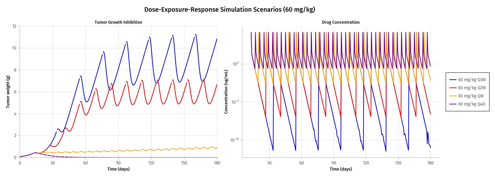

## Introduction

Parameter estimation is a fundamental step in QSP model development. It bridges the gap between theoretical model structures and real experimental data, transforming a conceptual model into a calibrated tool for prediction.

This session covers:

1. **PK Parameter Estimation**: Fitting 2-compartment PK model to concentration data
2. **PKPD Parameter Estimation**: Estimating Simeoni TGI parameters with fixed PK
3. **Dose-Response Simulations**: Exploring dosing schedules for optimal tumor control

### Two-Stage Estimation Approach

For PK-PD models like Simeoni, a sequential (two-stage) approach is common:

1. **Stage 1**: Estimate PK parameters from concentration-time data
2. **Stage 2**: Fix PK parameters and estimate PD parameters from tumor data

This approach simplifies the optimization problem and ensures PK parameters are informed by concentration data (not tumor response).

---

## Part A: PK Parameter Estimation

### Data Overview

The PK data consists of drug concentration measurements following a 45 mg/kg dose of CPT-11:

- **Source**: `data/PKdata.csv`
- **Observations**: 7 time points (Day 13 to 15)
- **Dose**: 45 mg/kg (0.9 mg total for 25g mouse)
- **Measurement**: Plasma concentration (ng/mL)

### Error Model Selection

The choice of residual error model affects parameter estimates and model fit:

**Additive Error**:
$$DV \sim \mathcal{N}(\hat{y}, \sigma_{add})$$

- Variance is constant regardless of predicted value
- Appropriate when measurement uncertainty is independent of concentration

**Proportional Error**:
$$DV \sim \mathcal{N}(\hat{y}, |\hat{y}| \cdot \sigma_{prop})$$

- Variance scales with predicted value
- Appropriate for data spanning multiple orders of magnitude (typical for PK)

For concentration data with rapid decline from peak to trough, **proportional error** is generally preferred as it properly weights observations across the concentration range.

### Estimation Approach: NaivePooled

The `NaivePooled` approach treats all observations as coming from a single "typical" individual:

- No inter-individual variability (IIV) is estimated
- Appropriate for pooled data where individual identity is not tracked
- Faster and simpler than mixed-effects approaches

```{julia}
#| eval: false
#| code-fold: true

# Fit proportional error model using NaivePooled
fit_proportional = fit(
    pk_model_proportional,
    pk_population,
    init_params_prop,
    NaivePooled()
)
```

### PK Results

The estimated PK parameters:

| Parameter | Estimate | Units | Interpretation |
|-----------|----------|-------|----------------|
| $k_{el}$ | 13.69 | day$^{-1}$ | Rapid elimination (t½ ≈ 1.2 hours) |
| $k_{12}$ | 0.27 | day$^{-1}$ | Moderate distribution to peripheral |
| $k_{21}$ | 1.49 | day$^{-1}$ | Redistribution from peripheral |
| $V_c$ | 0.078 | L | Central compartment volume |

The rapid elimination rate ($k_{el}$ ≈ 13.7 day$^{-1}$) corresponds to a half-life of approximately 1.2 hours, which is characteristic of CPT-11 in mice.

### Model Comparison

Model selection uses information criteria (lower is better):

| Metric | Additive | Proportional |
|--------|----------|--------------|
| AIC | Higher | **Lower** |
| BIC | Higher | **Lower** |

The proportional error model provides better fit for this PK data.

---

## Part B: PKPD Parameter Estimation

### Data Overview

The PD data consists of tumor weight measurements across three dose groups:

- **Control**: No drug (natural tumor growth)
- **45 mg/kg**: Single dose at Day 13
- **60 mg/kg**: Single dose at Day 13

Source files:

- `data/PDdata_control.csv`
- `data/PDdata_AllDoses.csv`

### Fixed Parameters

For PKPD estimation, the following parameters are **fixed** at values from PK estimation:

| Parameter | Fixed Value | Source |
|-----------|-------------|--------|
| $k_{el}$ | 13.686 | PK estimation |
| $k_{12}$ | 0.271 | PK estimation |
| $k_{21}$ | 1.488 | PK estimation |
| $V_c$ | 0.078 | PK estimation |
| $\psi$ | 20.0 | Literature convention |

### Estimated PD Parameters

The Simeoni TGI parameters are estimated:

| Parameter | Estimate | Units | Interpretation |
|-----------|----------|-------|----------------|
| $\lambda_0$ | 0.124 | day$^{-1}$ | Exponential doubling time ≈ 5.6 days |
| $\lambda_1$ | 0.345 | g/day | Linear growth rate |
| $k_1$ | 0.819 | day$^{-1}$ | Transit half-time ≈ 0.85 days |
| $k_2$ | 7.45 × 10$^{-4}$ | mL/(ng·day) | Drug potency |
| $w_0$ | 0.085 | g | Initial tumor weight |

### Fitting Strategy

The `constantcoef` argument specifies which parameters to fix:

```{julia}
#| eval: false
#| code-fold: true

fit_pkpd = fit(
    pkpd_model,
    pd_population,
    init_params,
    NaivePooled();
    constantcoef = (
        :tvk_el,
        :tvk12,
        :tvk21,
        :tvVc,
        :psi
    )
)
```

### Goodness-of-Fit

Model validation includes:

1. **Observations vs Predictions**: Scatter plot should show points along identity line
2. **Subject Fits**: Individual time-course plots for each dose group
3. **Residual Analysis**: Residuals should be randomly distributed

---

## Part C: Dose-Exposure-Response Simulations

### Scenario Design

Using the calibrated model, we explore different dosing schedules to understand the relationship between dosing frequency and tumor control.

**Fixed parameters**:

- Dose: 60 mg/kg (1.2 mg total)
- Treatment start: Day 13 (tumor reaches ~1g threshold)
- Observation period: 180 days (6 months)

**Variable**: Dosing frequency

| Schedule | Interval | Total Doses (180 days) |
|----------|----------|------------------------|
| Q3W | Every 21 days | 8 doses |
| Q2W | Every 14 days | 12 doses |
| QW | Every 7 days | 24 doses |
| Q4D | Every 4 days | 42 doses |

### Simulation Results

{width=100%}

### Summary Table

| Schedule | Final Tumor (g) | Min Tumor (g) | Max Tumor (g) | Cmax (ng/mL) | Total Doses |
|----------|-----------------|---------------|---------------|--------------|-------------|
| Q3W | 10.88 | 0.085 | 11.24 | 15,385 | 8 |
| Q2W | 6.71 | 0.085 | 7.11 | 15,385 | 12 |
| QW | 0.91 | 0.085 | 0.97 | 15,385 | 24 |
| Q4D | 0.0 | 0.0 | 0.44 | 15,385 | 42 |

---

## Key Insights

### Exposure vs Response

1. **Cmax is dose-dependent, not frequency-dependent**: All schedules achieve the same peak concentration (~15,000 ng/mL) because they use the same dose amount.

2. **Tumor control depends on sustained exposure**: The Q4D schedule achieves tumor eradication while Q3W shows minimal suppression, despite identical Cmax.

3. **Drug half-life matters**: CPT-11's short half-life (~1.2 hours) means drug levels drop rapidly between doses. More frequent dosing maintains therapeutic pressure.

### Biological Interpretation

- **Q3W/Q2W**: Long inter-dose intervals allow tumor regrowth between treatments. The tumor "escapes" before the next dose.

- **QW**: Weekly dosing provides reasonable control but tumor oscillates around a non-zero value.

- **Q4D**: Every-4-days dosing maintains sufficient drug pressure to prevent tumor recovery, eventually achieving eradication.

### Clinical Implications

1. **Metronomic dosing**: More frequent, lower-intensity dosing may outperform infrequent high doses for drugs with short half-lives.

2. **Exposure metrics**: AUC (total exposure) and time above threshold may be better predictors of efficacy than Cmax alone.

3. **Schedule optimization**: The optimal dosing frequency depends on:
   - Drug half-life
   - Tumor doubling time
   - Drug potency (k₂)
   - Tolerability constraints

---

## Pumas Implementation

### Dosage Regimen Creation

```{julia}
#| eval: false
#| code-fold: true

# Q4D: Every 4 days, 42 total doses
dr_q4d = DosageRegimen(
    1.2,                    # dose amount (mg)
    time = 13.0,            # first dose at day 13
    cmt = 1,                # central compartment
    ii = 4,                 # inter-dose interval (days)
    addl = 41               # additional doses (total = 1 + addl)
)
```

### Running Simulations

```{julia}
#| eval: false
#| code-fold: true

# Create subject with dosing regimen
subject = Subject(id = "Q4D", events = dr_q4d, time = time_grid)

# Run simulation with estimated parameters
sim = simobs(scenario_model, subject, sim_params)

# Convert to DataFrame for analysis
sim_df = DataFrame(sim)
```

---

## Hands-On Exercises

The complete implementations are available in:

- 📁 `Handson/PKestimation.jl` - PK model fitting with error model comparison
- 📁 `Handson/PKPDestimation.jl` - PKPD estimation with fixed PK parameters
- 📁 `Handson/SimulationScenarios.jl` - Dose-response scenario simulations

### Exercise Ideas

1. **Error Model Comparison**: Fit both additive and proportional error models. Compare AIC/BIC values. Which model is preferred?

2. **Parameter Sensitivity**: Change one estimated parameter by ±20%. How does it affect model predictions?

3. **New Dosing Scenario**: Design a dosing regimen that achieves tumor control with fewer total doses than Q4D. (Hint: Consider loading dose strategies.)

4. **Alternative Schedules**: Simulate Q5D and Q6D schedules. At what interval does tumor control start to fail?
