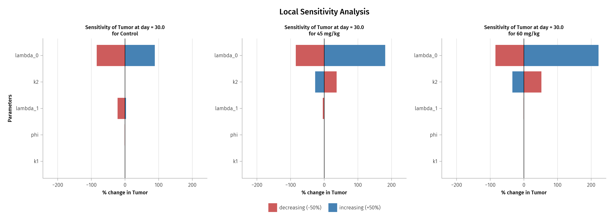
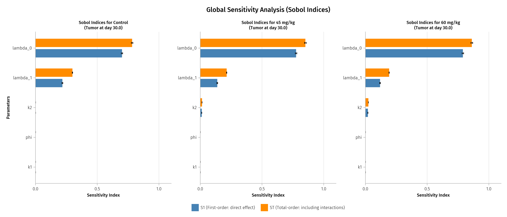

## Introduction

Sensitivity analysis quantifies how model outputs change in response to parameter variations. It addresses fundamental questions in QSP modeling:

- **Which parameters matter most?** Focus estimation efforts on influential parameters.
- **Which parameters can be fixed?** Simplify models by fixing insensitive parameters.
- **How uncertain are predictions?** Propagate parameter uncertainty to outputs.
- **Where should data be collected?** Design experiments to constrain sensitive parameters.

### Two Complementary Approaches

| Approach | Abbreviation | Description |
|----------|--------------|-------------|
| Local Sensitivity Analysis | LSA | Perturbations around a single baseline point |
| Global Sensitivity Analysis | GSA | Sampling across the entire parameter space |

Both approaches provide valuable but different insights. LSA is computationally fast and intuitive; GSA captures nonlinear effects and parameter interactions.

---

## Part A: Local Sensitivity Analysis (LSA)

### Methodology

LSA uses **one-at-a-time (OAT)** perturbation:

1. Start with baseline parameter values
2. Perturb one parameter by a fixed percentage (e.g., ±50%)
3. Run simulation and record the output
4. Repeat for each parameter

This approach assumes other parameters remain at their baseline values while one is varied.

### Configuration

For the Simeoni model LSA:

| Setting | Value |
|---------|-------|
| Perturbation | ±50% of baseline |
| Endpoint | Tumor weight at Day 30 |
| Parameters | λ₀, λ₁, ψ, k₁, k₂ |
| Dose groups | Control, 45 mg/kg, 60 mg/kg |

### Sensitivity Metric

The total sensitivity for each parameter combines both directions:

$$\text{Sensitivity} = \frac{|\Delta y|_{+50\%} + |\Delta y|_{-50\%}}{y_{\text{baseline}}} \times 100\%$$

where $\Delta y$ is the change in output (tumor weight) from baseline.

### LSA Results

{width=100%}

### Reading Tornado Plots

Tornado plots visualize parameter sensitivity:

- **Bar direction**: Effect direction (positive = parameter increase → output increase)
- **Bar length**: Magnitude of effect (longer = more sensitive)
- **Parameter ordering**: Sorted by total sensitivity (most sensitive at bottom)
- **Color**: Blue = +50% perturbation, Red = -50% perturbation

### Interpretation by Dose Group

**Control (No Drug)**:

| Parameter | +50% Effect | -50% Effect | Interpretation |
|-----------|-------------|-------------|----------------|
| λ₀ | +89% | -84% | **Dominant driver** of tumor growth |
| λ₁ | +3% | -22% | Moderate effect on late-stage growth |
| ψ | +0.2% | -1% | Minimal effect |
| k₁ | 0% | 0% | No effect (no drug) |
| k₂ | 0% | 0% | No effect (no drug) |

**Treated Groups (45, 60 mg/kg)**:

- λ₀ remains the most sensitive parameter
- **k₂ becomes influential**: Higher k₂ → smaller tumor (more effective killing)
- Sensitivity to k₂ increases with dose (60 mg/kg more sensitive than 45 mg/kg)

### LSA Summary Table

| Parameter | Control | 45 mg/kg | 60 mg/kg | Effect Direction |
|-----------|---------|----------|----------|------------------|
| λ₀ | 173% | 266% | 306% | ↑ λ₀ → ↑ tumor |
| k₂ | 0% | 64% | 86% | ↑ k₂ → ↓ tumor |
| λ₁ | 25% | 4% | 1% | ↑ λ₁ → ↓ tumor |
| k₁ | 0% | 0.3% | 0.5% | ↑ k₁ → ↓ tumor |
| ψ | 1% | 0% | 0% | Minimal |

---

## Part B: Global Sensitivity Analysis (GSA)

### Methodology: Sobol Variance-Based Analysis

GSA explores the **entire parameter space** simultaneously:

1. Define parameter ranges (e.g., ±50% around baseline)
2. Sample parameter combinations using Sobol sequences
3. Run simulations for all samples
4. Decompose output variance to attribute contributions to parameters

The Sobol method provides a rigorous framework for variance decomposition that captures both individual parameter effects and interactions.

### Configuration

| Setting | Value |
|---------|-------|
| Parameter ranges | ±50% of baseline (uniform sampling) |
| Number of samples | 1,000 |
| Bootstrap replicates | 100 (for confidence intervals) |
| Endpoint | Final tumor weight at Day 30 |
| Parameters varied | λ₀, λ₁, ψ, k₁, k₂ |

### Sobol Indices Explained

**First-Order Index (S1)**:

$$S_1 = \frac{V[E(Y|X_i)]}{V(Y)}$$

- Fraction of output variance explained by parameter $X_i$ **alone**
- S1 = 0.5 means parameter explains 50% of variance directly
- Higher S1 → stronger **direct** effect

**Total-Order Index (ST)**:

$$S_T = 1 - \frac{V[E(Y|X_{-i})]}{V(Y)}$$

- Includes direct effect **plus all interactions** with other parameters
- ST ≥ S1 always (equality when no interactions)
- Higher ST → parameter is important (directly or through interactions)

**Interaction Contribution**:

$$\text{Interaction} = S_T - S_1$$

- Quantifies how much of the parameter's influence comes from interactions
- Large interaction → parameter's effect depends on other parameter values

### GSA Results

{width=100%}

### Key GSA Findings

**Control Group**:

| Parameter | S1 | ST | Interaction | Interpretation |
|-----------|-----|-----|-------------|----------------|
| λ₀ | 0.70 | 0.78 | 0.08 | Dominant driver + moderate interactions |
| λ₁ | 0.22 | 0.30 | 0.08 | Secondary driver + interactions |
| ψ | ~0 | ~0 | ~0 | Negligible effect |
| k₁ | ~0 | ~0 | ~0 | No effect (no drug) |
| k₂ | ~0 | ~0 | ~0 | No effect (no drug) |

**Treated Groups (45, 60 mg/kg)**:

| Parameter | S1 | ST | Trend |
|-----------|-----|-----|-------|
| λ₀ | 0.78-0.79 | 0.85-0.86 | Most important |
| λ₁ | 0.12-0.14 | 0.19-0.21 | Secondary |
| k₂ | 0.01-0.02 | 0.01-0.02 | Emerges with drug |
| k₁ | ~0 | ~0 | Minimal |
| ψ | ~0 | ~0 | Negligible |

---

## LSA vs GSA Comparison

| Aspect | LSA | GSA |
|--------|-----|-----|
| **Parameter space** | Local (±50% around one point) | Global (entire range) |
| **Perturbation** | One-at-a-time | All parameters simultaneously |
| **Interactions** | Not captured | Quantified via ST - S1 |
| **Nonlinearity** | Limited capture | Fully captured |
| **Computation** | Fast (~30 simulations) | Intensive (~1000+ samples) |
| **Output format** | % change (tornado) | Variance fraction (Sobol) |
| **Best for** | Quick screening | Comprehensive analysis |

### When to Use Each Method

**Use LSA when**:

- Quick parameter screening is needed
- Model is approximately linear
- Interactions are expected to be small
- Computational resources are limited

**Use GSA when**:

- Comprehensive analysis is required
- Nonlinear effects are suspected
- Parameter interactions matter
- Uncertainty quantification is the goal

---

## Biological Interpretation

### Parameter Effects on Tumor Growth

**λ₀ (Exponential Growth Rate)**:

- Most influential parameter across all conditions
- Determines how fast the tumor grows early (when small)
- S1 ≈ 0.70-0.79 → explains 70-79% of tumor variance
- **Clinical relevance**: Accurate estimation of λ₀ is critical for predictions

**λ₁ (Linear Growth Rate)**:

- Secondary importance, affects late-stage growth
- Interacts with λ₀ (ST > S1 by ~0.08)
- **Clinical relevance**: Important for long-term predictions

**k₂ (Drug Potency)**:

- **No effect in control** (no drug present)
- Becomes relevant in treated groups
- Higher dose → greater sensitivity to k₂
- **Clinical relevance**: Key parameter for treatment optimization

**k₁ (Transit Rate)**:

- Minimal direct effect on tumor weight
- Controls timing of cell death, not magnitude
- May matter more for time-course shape than endpoint

**ψ (Transition Sharpness)**:

- Negligible effect when fixed at conventional value (20)
- Model predictions robust to ψ uncertainty
- **Justification** for fixing ψ during estimation

---

## Practical Guidelines

### Workflow Recommendation

1. **Start with LSA**: Quick screening to identify potentially sensitive parameters
2. **Focus estimation efforts**: Prioritize accurate estimation of sensitive parameters
3. **Use GSA for validation**: Confirm findings and quantify interactions
4. **Report both S1 and ST**: Provides complete picture of parameter behavior

### Interpretation Rules of Thumb

| Index Value | Interpretation |
|-------------|----------------|
| S1 > 0.5 | Dominant driver of variance |
| S1 = 0.1 - 0.5 | Moderate contributor |
| S1 < 0.1 | Minor contributor |
| ST - S1 > 0.1 | Significant interactions |
| ST - S1 < 0.05 | Acts largely independently |

### Computational Considerations

- **LSA**: ~(2 × n_params + 1) × n_groups simulations
  - For 5 parameters, 3 groups: ~33 simulations
- **GSA**: ~n_samples × (n_params + 2) × n_groups model evaluations
  - For 1000 samples, 5 parameters, 3 groups: ~21,000 evaluations

---

## Pumas Implementation

### LSA: Parameter Perturbation

```{julia}
#| eval: false
#| code-fold: true

# Perturb one parameter by ±50%
function perturb_params(baseline, param_name, direction)
    factor = direction == :increase ? 1.5 : 0.5  # ±50%
    params_dict = Dict(pairs(baseline))
    params_dict[param_name] = baseline[param_name] * factor
    return NamedTuple(params_dict)
end

# Run perturbed simulation
params_inc = perturb_params(baseline_params, :tvlambda0, :increase)
sim_inc = simobs(lsa_model, subject, params_inc)
```

### GSA: Sobol Analysis in Pumas

```{julia}
#| eval: false
#| code-fold: true

using GlobalSensitivity

# Define parameter ranges (±50% of baseline)
p_range_low = (
    tvlambda0 = baseline.tvlambda0 * 0.5,
    tvlambda1 = baseline.tvlambda1 * 0.5,
    psi       = baseline.psi * 0.5,
    tvk1      = baseline.tvk1 * 0.5,
    tvk2      = baseline.tvk2 * 0.5,
)

p_range_high = (
    tvlambda0 = baseline.tvlambda0 * 1.5,
    tvlambda1 = baseline.tvlambda1 * 1.5,
    psi       = baseline.psi * 1.5,
    tvk1      = baseline.tvk1 * 1.5,
    tvk2      = baseline.tvk2 * 1.5,
)

# Run Sobol GSA
gsa_result = Pumas.gsa(
    gsa_model,
    subject,
    baseline_params,
    Sobol(nboot = 100),          # Method with bootstrap CI
    [:final_tumor],               # Output variable from @observed
    p_range_low,
    p_range_high;
    constantcoef = (:tvk_el, :tvk12, :tvk21, :tvVc, :tvw0),
    samples = 1000
)
```

### Model with `@observed` Block (Required for GSA)

```{julia}
#| eval: false
#| code-fold: true

gsa_model = @model begin
    # ... @param, @pre, @init, @vars, @dynamics blocks ...

    @derived begin
        tumor_obs = @. tumor
    end

    # Scalar endpoints for GSA (required for Sobol analysis)
    @observed begin
        final_tumor = last(tumor_obs)
    end
end
```

---

## Hands-On Exercises

The complete implementations are available in:

- 📁 `Handson/LocalSensitivityAnalysis.jl` - LSA with tornado plot visualization
- 📁 `Handson/GlobalSensitivityAnalysis.jl` - GSA with Sobol indices

### Exercise Ideas

1. **Change Perturbation Range**: Run LSA with ±25% instead of ±50%. How do sensitivity rankings change?

2. **Different Endpoint**: Modify the code to analyze tumor weight at Day 50 instead of Day 30. Which parameters become more/less important?

3. **Add PK Parameters**: Include $V_c$ and $k_{el}$ in the sensitivity analysis. How do PK parameters compare to PD parameters?

4. **Sample Size Effect**: Run GSA with 500 vs 2000 samples. How do confidence intervals change?

5. **Interaction Analysis**: For treated groups, calculate ST - S1 for each parameter. Which parameters show the strongest interactions?
